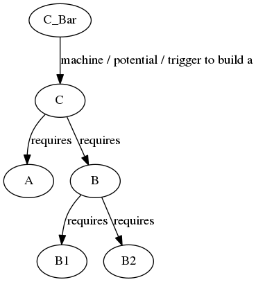
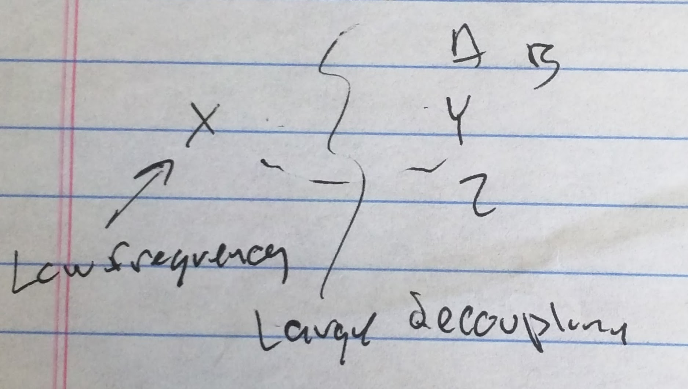
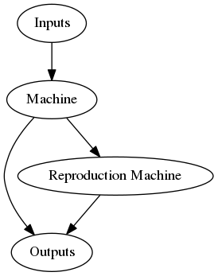
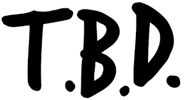
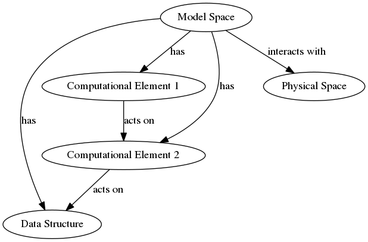

- TOC
{:toc}

# Overview

{:width="300px" }

The Figure *Concept Encapsulation* shows:  

- Key / Lock as the fundamental construct.
- Universal Compute (Turing Machine) builds on Key / Lock.
- Compute as static data builds on Universal Compute
  - Think the idea is static data is just compute in a locked state / invariant against most externals.
- Particle Model and Addressing Model build on the previous
- Building Blocks / Reused components build on the previous
- Blade of Grass
  - Most encompassing level
  - Key idea is exponential growth from Reproducing Components
  - Is a potential way to compress search space of model configurations to improve modeling quality.

# Particle Model

Conservation of particles  

Q) Is Conservation of particles a requirement?

Relationships to other models:  

  Locking Concept  

  Particles essentially establish and release locks.  

  State Model  

-------------

# State Model

*State*  

*Stable States*  

- Transition is not freely occurring between states.  

Q) How are stable states exhibited?   What are some examples?

*Static States*  

*Hierarchical State Structure*

## Relationships to other models:  

Locking Concept: Stable states result when a lock state prevents transitions.  

-------------

# Structure

Static Structure

Dynamic Structure

Q) How is static state exhibited?
Q) How is static structure exhibited?

Orthogonal Grid

## Equivalence of Structures

$$
\begin{align*}
    Structure A &= Structure B + Fundamental Traversal Algorithms \\
    Structure A &= Structure B + Translation Function \\
\end{align*}
$$

Structure A and B can be any structure.

Universality of Turing Machines indicates everything is decompose able to a binary path change in a function tree.

## Relationships to other models:  
Locking Concept:  
Particle Model:    

## Emergent Structure

Some fundamental lock upon which hierarchies can be built.

Some nature that allows locking at higher level.  This seams to be some locality of scope.

Again the idea of rules and some combination that satisfies those rules.

Notion of replication DNA like mechanism that induces order.

### Orthogonal Space Structures

{:width="300px"}

See figure *Grid Substrate*  

Rules:  

- O can bind to * when X present at *
- Z can bind to * when 8 O present at *

### Group / Cluster / Lock formation

Point in space balance protons /

One grouping more favorable than another grouping.

Must add energy to one grouping to break apart or get to another grouping.

Another way of representing grouping is to say some objects must be present for objects to exist in the state ten do:  

Q1) What is present

Q2) Implies Sub Objects

Another way to say say is an object is a stable collection of sub objects.

Stable in the sense their is some sort of balance between objects of a specific type for example.

This brings in the idea of local minima.

In a multidimensional equation.

Their is some stable grouping of elements at a local minima.

Change the number of elements and you can exit the local minima.

Again this implies grouping and locality.

How do you track a relationship between a subset of objects?

One way is to tag objects with an id.

Back to Quantum effects.

-------------

# Locking Concept

Lock:  

- Constraint restricting change in some domain(s).
- Change can be thought of as compute, transitions, transactions, movement, etc.

Keys:  

- Prerequisites in domain A enabling locking and unlocking within domains ~A.
- Keys + Transactions = Changes in lock state.  (analogy: turning a key in a lock.)

Locking Concept as means to produce a orthogonal grid.

- Interactions
- Aggregations
- Flow, Time type components
- Linear Spaces - Lattice Structure Provides Position and Locality
- Cascade / Catalyst Events are important
  - More powerful interaction trumping less powerful lock

# Static Structure as Locked Compute Model  

Static Structure = Dynamic Structure + Locked State

Dynamic Structure = static (Program) + dynamic building blocks (Compute)

Static Structure = (static (program) + dynamic building blocks (compute)) + locked state

The concepts of state and structure as a result of locks can be directly modeled with Turing machines.

## Particle Interaction

{: width="300px"} 

See figure *Particle Interaction Example*

Example Has:  

- conservation of particles
- linear spaces
- locks

Chaining results in linear or hierarchical data structure

## State Structure View

~~~ ruby
require "graph"

digraph do
  nodes = { 
    s1: node("s1"), 
    s2: node("s2"), 
    s3: node("s3"), 
    s4: node("s4"), 
    cursor: node("cursor") 
  }

  edge(nodes[:s1].name, nodes[:s2].name).label("Cause 1")
  edge(nodes[:s2].name, nodes[:s3].name).label("Cause 3")
  edge(nodes[:s2].name, nodes[:s4].name).label("Cause 2")
  edge(nodes[:s2].name, nodes[:s1].name).label("Cause 4")
  edge(nodes[:cursor].name, nodes[:s2].name)
  
  save 'tmp/state_structure_view', 'png'
end
~~~
{: .language-ruby .execute_and_replace}

{: width="300px" }

See figure *State Structure View*.

- State structure is traverse-able
- State nodes are related but different
- State transitions are triggered by Causes (ex C1, C2)
- Particle may be available in specific state(s)
- Current state is associated with a Cursor.

## Compute Is...

- Different data structures projected against each other

{:width="300px"}

See figure *Compute View*

This is a Turing machine made from controlled unlocking of sub state in a set of data structures projected against each other in terms of unlocking dependencies.

Unlocking allows a data structure to be accessed and or modified.

Unlocking can be thought of as enabled by a key.
The key can be thought of as a particle.

{:width="300px"}

Figure *Turing View* shows:  
- Keys or particles enabling access to other data structures.  
- Shows concept of a cursor selecting a specific node in a data structure.

## Important Theory
- A particle is a key that unlocks access to a decoupled domain

- In the same sense a particle is the indirection allowing addressing into a decoupled domain

- Given the above we can build...
  - Data structures (linear, tree, etc.)
  - Compute as extension of Turing machines

- What remains are questions of efficiency of model environment
  - ratio of P1 to P2  (Particle to Particle)
  - ratio of P1 to D1  (Particle to Domain)
  - ratio of D1 to D1  (Domain to Domain)

- Need to add in concept of a cursor
- The concept of cursor seems to be important in terms of compression at many layers of re-use of data structures and generic compute elements.

-------------

# Cursor Concept

- Cursor is like instance data in an object instance
- Cursor is the ability to move among a constrained set of domains
- In a quantum sense you could think of widening or narrowing the set of domains visible to another domain(s) based on locking in constraints.
- Perhaps a cursor should be thought of as a key ring.
  The keys on the key ring determine the domains that are simultaneously visible to each other.

A Cursor is a pointer allowing multiple actors or compute instances to reference the same structure or computational element.

{:width="300px"}

The figure *Cursor Key Ring* begins to connect the ideas of largely disjoint spaces, coupling between spaces, locks / keys and cursors.

In the figure [Cursor Key Ring]:  

- Rooms are containers for disjoint spaces containing different structures.
- The contents of the rooms / containers can act on each other if allowed to mix.
- Rooms can be unlocked by keys giving access to common areas where the contents can mix.
- The keys can be associated or grouped on a 'key ring'
- Conceptually the keys on the key ring are like cursors into the disjoint spaces.
- Which keys are on the key ring determine which rooms are visible simultaneously.
- The keys on the key ring can be changed.
 
{: width="300px"}

The figure *Cursor role in Turing Machine* shows:  
- Three components of Turing Compute Model.
  - Program
  - Memory
  - State at memory address
- Cursor role in all three components.
- The idea of projecting what is pointed to by the cursors against each other.

{: width="300px" }

The figure *Cursor and Actor as Similar Constructs* shows:  

-Actors providing cursor type functionality to reference state in other data structures. 

Actors:  

- Abstract and decouple interaction
- Support specific interactions

Structure can be reused by multiple actors
Multiple references can be made into the same subspace / structure.
The reference makes state local with out a copy.
References can be redirected to change local state.

{: width="300px" }

{: width="300px" }

The figures *Actor Model to Implement Turing Machine* and *Actor Model to Implement Turing Machine Detained* show:  
- Generalized Turing Machined implemented with actors coupling the state of the three components in the Turing machine.  
- This continues to reinforce the Actor model as a means to implement or realize cursors as cursors were previously shown to be a key component to the Turing model.  

-------------

# Blade of Grass Model

- Structure will arise within any sufficiently fertile environment.

Example: Grasses, trees, animals, humans will develop and will grow to limits defined by available resources.

The nature and makeup of emerging structures will match the resources available in the environment.

## Creating a fertile environment (Requirement 1)

A fertile environment is a prerequisite for growth and proliferation of structures.

Note the connection here with the spontaneous order concepts in Quantum physics and "theory of constraints" 

## Shaping the environment (Requirement 2)

Q) How do you make the world that is produced useful?

A) You Kill Weeds. You Mow Grass.  You cut down trees.  In other words some actor modifies the environment to meet it's needs.  
A) Actor moves to a place that produces what is wanted.

## Actor interaction with environment

Actors likely need rich multidimensional interactions to effectively shape and select environments.

Human assisted, or even machine assisted, algorithms likely need rich multidimensional interactions, for example graphical or visual interactions, to shape and select environments.

Programming (text based) and or statistics based systems are likely too limited for large systems and long time frames.

An analogy is an information portal or pipe between environments or between an actor and an environment.

The portal or pipe must be:  

1) Sufficiently sized to allow the actor to prosper. Too much information or too little information results in failure.

2) The information must be relevant to actor prosperity.

3) The information must be symbolic or decoupled such that it's actionable.

## Qualities of a fertile environment

{: width="300px"} 

See figure *Fertile Environment for Resource Restructuring*.

1) Reaches Stability  
2) Seeds can dramatically change resource structure  
3) Sensitive to resource changes (think diversity)  
4) Rapid growth is possible.  

{: width="300px"} 

See figure *Transforms in Fertile Environment*.

## Analogies to growth of organisms in environment

**Precondition** - Region with set of resources.  
(Analogy: rich soil, warm weather, water, etc. supporting plant growth.)

**Kernel**: (Analogy - Seed)

- Bootstrap Capability
- Minimal  - Cheap to widely produce "seed"
- Distribution - Can be spread well in the environment. Spread far.  Spread evenly. Spread to new environments.
- Contains enough Information to define key elements of organism

**Bootstrap Capability**

The kernel (analogy "Seed") must germinate and with minimal resources be successful at shaping an environment to bootstrap the continued growth of the organism.

Success of the organism depends on the success of the "seed".

**Process**

Kernels are distributed into the environment.

Kernels bootstrap.

Info from kerenls define / direct combination of resources from environment into larger machine.

Larger machines ultimately produce more kernels that are distributed into the world.

**Observations**

Locking process is required.
  Combinations can be established that are unlikely to be reversed by random events

Instructions are required.
  Locked data structures that can drive machine like operations.

Memory is required

Process happens at different scales

Q) How to expand in size, time, etc?
A) Hierarchical Preconditions

{: width="300px"} 

See figure *Hierarchical Preconditions*.

Q) How to scale?
A) Lower layers are natural relationships in world and X's are provided by world.
   All that is required is catylist to enable lower layers.

**Concept**

A susceptibility to organization must be wide spread within the environment then instructions just drive higher level of organizations.

The world is like an unknown part of the organism.  An essential part of the organism that is not always associated with it.

**Implications**

Bottom layers of hierarchy are provided by the world.  
These bottom layers can be thought of as a "primed and ready to go" or "fertile" part of the environment.  (Analogy is rich black soil.)

These bottom layers can be thought of as building blocks.

The building blocks are both diverse and extensive enough to support X number of layers about them.

Q) What about sample vs every thing in hierarchy?

System is primed for reinforcement learning.

Some sort of memory or hysteresis is required.

Presence of node in upper hierarchy will allow or precondition lower nodes to be instantiated.

Then you need a memory component to potentiate lower nodes to future presence of trigger node or related trigger node.

### Question

{: width="300px" }

See figure *Building Block Hierarchy*.

$$X_{Bar}$$ is a precondition (state)

Seems likely $$X_{Bar}$$ is a combination of form 

$$X_{Bar} = A * B * C$$

$$X_{Bar} == A or B or C$$   ??  
$$X_{Bar} == A and B and C$$ ??  

What if $$X_{Bar}$$ is not a single state but an instance, a particle?

~~~ ruby
$LOAD_PATH << "#{Dir.home}/scripts/utility"
require "concept_map"

cm = Concept_Map.new

cm.edge('Kernel', 'includes', 'F')
cm.edge('Kernel', 'includes', 'E')
cm.edge('F', 'requires', 'E')

cm.edge('Layer X-2 Actor', 'includes', 'B')
cm.edge('Layer X-2 Actor', 'includes', 'A')
cm.edge('B', 'requries', 'A')

cm.edge('E', 'can use', 'B')
cm.edge('E', 'can use', 'D')

cm.edge('Layer X-1 Actor', 'includes', 'D')
cm.edge('Layer X-1 Actor', 'includes', 'C')
cm.edge('D', 'requires', 'C')

cm.edge('C', 'requires', 'B')

cm.render('tmp/kernel_world_kernel_ordering')
~~~
{: .language-ruby .execute_and_replace}

{:height="3in"}

See figure *Kernel World Kernel Dependency or Ordering*.

### Construction Questions

~~~ ruby
$LOAD_PATH << "#{Dir.home}/scripts/utility"
require "concept_map"

cm = Concept_Map.new

cm.edge('C_Bar', 'machine / potential / trigger to build a', 'C')
cm.edge('C', 'requires', 'A')
cm.edge('C', 'requires', 'B')
cm.edge('B', 'requires', 'B1')
cm.edge('B', 'requires', 'B2')

cm.render('tmp/construction_question_example')
~~~
{: .language-ruby .execute_and_replace}

{: width="300px" }

See figure *Construction Question Example*.

C - Actual particle or state

C_Bar - Machine / Potential / Trigger to build a "C"

Both C and C_Bar are important.

Should C_Bar only exist if A or B exist?

How many B's should be sitting around in world space waiting to produce C's.

Should the number of B's be function of potential ization of world described previously?

Q) What are the potential problems with the model?

- Reliance / Dependency on frequency of particles.
- The ratio of particles will impact the likelyhood of triggering.
- The ratio must be optimized for proper logic.
- Need to track existence and entanglement of many many particles.

----

Point - Existance of particle and particle factory

  In a sense a particle factory is a book keeping mechanism to properly allocate resources.

----

~~~ ruby
$LOAD_PATH << "#{Dir.home}/scripts/utility"
require "concept_map"

cm = Concept_Map.new

cm.edge('C_Bar', 'requires', 'A')
cm.edge('C_Bar', 'requires', 'B')

cm.edge('C', 'requires', 'A')
cm.edge('C', 'requires', 'B')

cm.edge('C_Bar', 'requires', 'C')

cm.render('tmp/construction_question_example_2')
~~~
{: .language-ruby .execute_and_replace}

{: width="300px" }

See figure *Construction Question Example 2*.

Q) Do A, B change state when state C_Bar is in existence?

- That would seem to match compounding of matter.
-  Atoms share electrons producing a more stable compound.
-  The individual atoms are not free to re associate as they originally were without reversing the sharing.

**Observation:** The Brain is assembling complexity all of the time. Similar to how complexity is assembled in the blade of grass example.

-------------

# Substrates

A message is it's own substrate.

Concepts:  

- Transactions dig through substrates.  
- Function constrains regions and patterns in input / output structures.  
- Substrates can be stacked.  
- Substrates are traversed.  
- Function as a view selector.

## Cursor as substrate selector
- Cursor opens access to a substrate.

{: width="300px" }

See figure *Cursor selecting substructure / substrate from linear structure*.

## Messages are their own substrates

The fields in a message are / have locations where data can be found.

This use of locations is equivalent to actors having locations.

The data structure locations can be accessed the same way other actors can be accessed at locations with messages.

Accessing a location in a data structure just means getting access to the substrate at that location where the substrate may contain another data structure.

## Substrate Operations

- Set operation
Combine
Divide / Partition
Criteria

### HTTP Example

{: width="300px" }

See figure *HTTP Transaction Example*.

The method name, "GET" is just another location in a subspace of methods.

In this case the GET create a new copy generated hierarchical subspace set as a new data structure by aggregating selected sub-spaces.

{: width="300px" }

See figure *Tunneling Through Substrates*.

Our functions / methods are just the equivalent of location identifiers in some subspace / substratum.

Something that makes functions / methods unique is the requirement to synthesize a new hierarchical subspace when the function / method is called.

Conventional Data structures are more static and don't require the synthesis of the hierarchical subspace when accessed.

This is probably related to copy on write behavior.

Once the hierarchical sub-spaces / actors in a data structure are created they can be accessed (read) repeatedly with out being reconstructed.

How are functions / methods different than data structure access if both are just steping through a hierarchy of sub-spaces to get to a space of interest?

$$z = f(x,y)$$

In this example,
x, y and f all constrain / select the hierarchical subspace Z.

X and Y each constrain down a hierarchical subspace.

Function f create h subspace z by traversing x and y.

Function f only makes sense if x and y have internal sub-spaces / locations known and constent with function f.

f is modular in that f works with many x's and y's sub-spaces.

A function / method:  

- describes / captures / modularizes
- the transform to create subspace z from x, y; $$z = f(x,y)$$
- instantiates / constructs subspace z
- constrains x and y to be a specific section of hierarchical structure so that f can traverse the structure
- but f does not constrain x and y to a specific instance

------

{: width="300px" }
{: width="300px" }

See figure *Function as a Subspace Selector*.

See figure *Data Structure Subspace Selector*.

A function defines how input spaces are constrained to produce an output space.

Function execution is applying the constraints to a region in the hierarchical input structures.

The result of function execution on sub-spaces that are not fully constrained is another function and an input set / space limited to the subspace(s) that are not fully constrained.

If / when the inputs are fully constrained the output is a subspace hierarchy that is fully constrained or defined.

-----

Interestingly:  

A fully constrained h subspace can be described as  
$$z = f()$$ (no inputs)

But...

A fully constrained h subspace is actually not observable and no longer seems to exist.

For a subspace to be visible and interesting to us the h subspace must be traversable.

Differentiation / Differences must exist in the h subspace.

Minimum traversability looks like:  

$$Z_L = f(position=l)$$ or $$Z_R = f(position=r)$$

In other words, minimum perceptibility requires:  

Observable_output_hspace = Transform_Function (at least one input that is not completely constrained)

Simplification with out complete convergence.

$$b=f(a) $$

b
: h sub-spaces

a
: h sub-spaces

If a is fully constrained then b is imperceptible

$$b=f_b(f_a(f_{a'}(f_{a''}(...))))$$

Some functions in the composite (at least one function) must remain unconstrained.
Some functions in the composite can be fully constrained.

$$b_\Delta=f_{b\Delta} ( f_{constrained}, f_{unconstrained} )$$

$$f_{constrained}$$
: this new function can be identified or retrieved by a hash

 parse -> execute;
   main -> init;
   main -> cleanup;
   execute -> make_string;
   execute -> printf
   init -> make_string;
   main -> printf;
   execute -> compare;
 }
'/>

# Computational Models

## Turing Machine Model

### Turing Machine Variations

Memory transitions from linear to hierarchical or other structures.

References into multiple memories or multiple points in same memory rather than just 1.

Memory locations contain more complicated structures than 0<--> Consequently more than 2 transitions out of single program node.

## Lambda Calculus Model

- Symbols
- Operators
- Recursion
- Transformations
- Combative
- Map / Reduce - Key Pattern
  - Select
  - Copy
  - Data Flow

Lambda Calculus and Turing Commonalities
: Both capture fundamental elements of computing
: Both are simplifications of existing mechanisms

Lambda Calculus and Turing Differences
: Lambda Calculus
  - Selecting Data Structures
  - data <==> function equivalence
  - recursion

: Turing Machines
  - Traversing Data Structures
  - Relies more on short term memory

## Functional Programming Model

- Purposes:  
  - Decoupling
  - Reuse

- Math Perspective: Relation / Mapping between a set of inputs and outputs
  - inputs: domains
  - outputs: co-domain
  - mapping: graph

- Function Space
  - set of functions in same domain + co-domain

- Function Composition
  - chaining functions

### Functions vs Static Structure / Data Structure

{: width="300px" }

See figure *Data Structure vs Function *.

- Data structures (ex. Graphs, Arrays, Lists, etc.) can be encapsulated in functions
- Function execution results in actions / function calls rather than output data structure.
- Abstraction / Decoupling from distinct spaces:  
  - Because $$f_{ABC}$$ simply invokes functions their is no constraint on the domain (input) and co-domains(output).
  - The functions can act on the same or different domains.

- Consider use of notation: $$f_A$$ - both the access method and the domain to operate on

This is a delta or write changing a reference to a node / symbol in a linked list data structure.

Definition: Context

From Functional programming:  

- Sharing structure is dangerous for mutable data
- Sharing structure is safe if data is immutable
- The example above shares a structure without mutating data
- Functional programming prefers immutable trees
- Contexts are like versions in git
  - this is really really important as it explains filter, reduce, etc.

{: width="300px" }

See figure *Immutable Structure in Functional Programming*.

In functional programming:  

- Mutation results in new immutable structure that makes maximum reuse of existing structures
- Garbage collection cleans up unused or invaluable trees
- Utility or value must be associated with a tree for preening 
- Their must be some rationality in spawning new trees.
  - What nodes are likely to work when connected to other nodes.
  - Almost like their is a search function associated w/ the node.

- The outputs of the functions have their own rolling state too.

### Decoupling in functional programming

Functions can be constructed to increase decoupling from the caller using Monad like constructs as shown in this pseudo code:  

~~~
f(io_handle) {
  a = io_handle.a();
  b = io_handle.b();
  c = io_handle.c();
  d = a + b + c;
  io_handle.d(d);
}
~~~

Note: This is very close to an actor model of interaction.

{: width="300px" }

See figure *Monads / actor messaging to increase decoupling when compositing functions or actors*.

Layer structure reuse.

{: width="300px" }

See figure *Reuse middle layers of composited function chains by tunneling inferior layers though stack*.

1) Figure illustrates the reuse of structure and connectivity... The structure on the right is much easier to establish, store and re-use than the multiple structures indicated on the left.

2) Figure starts to illustrate the idea of computation flows.  Some computations are blocked by dependencies or locks.  Others are not. Large sections of decoupled computations, as may be illustrated by f2, f3, f4, can be computed early or partially if not dependent on downstream elements of D5.

The functional model brings ideas:  

- Computations and computation chains have dependencies.
- The dependencies can be thought of as data resulting from other computations.
- Importantly the dependencies can be thought of as locks... Something must unlock to allow computation to proceed.
- Some set of composited computation is enabled whenever a lock is unlocked.
- Other sets of composited computation remains blocked by remaining locks.
- Effective computation in complex spaces requires computational (function composition) structures that decouple computation from locks such that as much computation as possible can be done early and often without duplication.

### General

{: width="300px" }

See figure *Core Benefit of Functional Programming*.

Any transform ultimately invokes functions that are narrow in scope and specific to a unique space or a limited space.

A core idea of functional programming is to push the specialized functions as far to the edges as possible.

A structure is a hierarchy of functions or transforms.

Ultimately the structure hierarchy must rely on function locks that are more static in nature.

Static in the sense that the locking mechanisms are decoupled from the structure and under the influence and control of outside actors.

From example, think of pointers to next elements in a structure.

The pointers are stable and not modified randomly.

Their are strong constraints on what functions can change the pointers that define the function.

{: width="300px" }

See figure *Addressable storage, Registers, Functions*.

Functions are combination of:  

- a tree of manipulations to perform on bit spaces in registers 
- operation to read / write from register to memory 
- operations to jump to nodes in a function tree

## Function Compositing / Modeling 'real world' spaces

### Coupling

{: width="300px" }

See figure *Coupling*.

Maximizing the amount of "existence" in a model

- Every element in the model is a function not data
- A function is the derivative of data
- Functions are the building blocks in the model
- Select the building blocks to maximize "existence"
  - then the building blocks will be optimized to model reality.
- Exert pressure on a model space to cause the model to conform to reality
- Don't start with blocks that over or under connect.

{: width="300px" }

See figure *Reference to a Linked List*.

### How to construct functional compositions to model or interact with "real world" spaces

{: width="300px" }

See figure *Functional Composition Construction for interaction with real world spaces*.

Building compositions to interact with 'real world like' spaces requires:  

- input candidate search
- output candidate search
- evaluation of fitness of composite

Diagram shows a set of immutable functional structures that represents the current state within a sub-space.

Candidate functional structures are selected from the current state set and combined.

The new combined structure becomes part of the current state set.

A fitness function could be applied to determine the prevalence of the new combined structure in the current state set.

An algorithm likely exists for picking the candidates for combination.

Combining functional structures can be though of as:  

- Projecting structures against each other.
- Establishing some amount of coupling between structures.

The notion of immutable structures in a content addressable storage is interesting in that:  

- New combined structures consist of a new unique structures that are coupled to and re-use fundamental blocks or fundamental structures that remain decoupled and unchanged.

- Consider the analogy to a adding a file to a directory in a git content addressable storage data store...
  - A new tar data structure for the directory is created and can be referenced by hash.
  - The new tar data structure for the directory references the hashes for the files included in the directory.
  - The hashes for the original files remain the same and continue to be stored in the git db.
  - A new hash is created (if required) for new files.
  - The tar for the directory references the old + new hashes for the old + new files in the directory.

### Relationship of functional programming to actor model

- Functions can be modeled as messages between actors.
- Parameters can be accessed as reverse functions or messages to implement the decoupling from specific sub-spaces described above.

-------------

# Convergent Search Algorithms

## Genetic Algorithm

GA is an optimized search algorithm.
GA Optimization depends on / finds / assumes graded assents.
GA optimizes assents across multiple variables and local maxima.
GA searches on multiple variables in parallel.

-------------

## Hiden Hierarchical Markov Models

Hidden Hierarchical Markov Model synthesizes hidden states / structure.
HHMM Synthesizes hierarchies.
HHMM searches for states in parallel.
HHMM is highly evidence driven.
HHMM has use case for classifying reality against a model after model is synthesized.

-------------

## Hierarchical Neural Nets

HNN synthesize hidden state
HNN synthesize hierarchical state

Reinforcement Learning...

Presumably model converges faster than HHMM??
or
Classification faster / better then HHMM??

Why is HNN thought to be better than HHMM?

A potential benefit of a builder is quicker convergence when creating models.

HNN / HHMM require convergence to a satisfactory model w/ significant input.

But in situations like real world where mechanism s are frequently repeated:  

- Out write tests of frequent models / mechanisms may converge faster than re-synthesis with HNN / HHMM

Investigation:  

Creating model vs Classifying input
Likewise, compression may be better??

-------------

## Actor Model

### Actor Decoupling

{: width="300px" }

See figure *Actor Decoupling*.

#### Actor Discovery Process

Thought Experiment: Actors placed in completely dark room. How do they find each other?

Ping:  

- Assumes actors have locations
- Capabilities are identified in the ping response.
- Assumes locations have connections
- Uses this location / space substrate to tunnel to other actors connected to this substrate
- Is transactional but different
- Location / Path to peer actor is carried in transaction

Location substrate is important for all communication

Beacon:  

- Like ping but announcement of location / capabilities nod discovery

Registration:  

- Updating location of actor in specific subspace / substrate

The "location" substrate is an enabler for decoupling and multi-instance.

### Actor Transactions

Transactions:  

- Require actors to have locations in a substrate
- Have State.
- Require actors to have shared information in terms of responding to messages.

Q) What can actors do?

- Bridge between substrates
- Tunnel between substrates
- Convert between message encoding
- Project structures from other substrates against each other

**Observation:** The message is it's own substrate.

Thought Experiment:  

  Actor / message model assumes messages are snapshots or copies of substrates / sub-spaces.

  What if we viewed the message as having access to the sub-spaces constrained by the message?

  What if multiple actors could modify the space?

  What if copy on write protocols were used?

*Theory:*

Transitions is just digging through substrates.

At least that's a large part of what transactions are.

This leads to the idea that efficiently representing the progression through substrates is important for efficiency.

Selecting a location in a substrate opens an new substrate.

Transaction as a hierarchy or sequence of access to sub spaces.

Actor model as generalization of:

- functional computation
- category theory
- universal machine
- Hidden Markov model
- layered neural network
- particle system
- blade of grass model

Questions:

- Q) How would actor model represent immutable data structure?
- Q) How would actor model represent immutable functional structure?
- Q) How is memory represented?

Parallel Actors Provide simultaneous evaluation and action.
Important question is how granular the evaluation and action are.

Evaluation == classification
Action == Manipulation

~~~ ruby
$LOAD_PATH << "#{Dir.home}/scripts/utility"
require "concept_map"

cm = Concept_Map.new

cm.edge('classifiers', 'monitor', 'view')
cm.edge('classifiers', 'compress information into', 'symbols')
cm.edge('manipulators', 'decompress', 'symbols')
cm.edge('classifiers', 'trigger', 'manipulators')
cm.edge('view', 'includes', 'world')
cm.edge('view', 'includes', 'hidden state')
cm.edge('manipulators', 'alter/modify', 'view')

cm.render('tmp/classifier_manipulator_interaction')
~~~
{: .language-ruby .execute_and_replace}

{: width="300px" }

See figure *Classifier Manipulator Interaction*.

Classifiers consolidate information into symbols and signals.
Manipulators are triggered by a classifier match then change something in the world or hidden state.

Classifiers compress a view into symbols.
Manipulators decompress symbols into transforms on the view / world / hidden state.

Q) How well can classification and hidden state be constructed if their is no direct manipulation of physical space?

T) Theory... AI actors can render audio / visual scene via monitor and this can be done by multiple AI actors in parallel, and human user can give effective feedback.
 
Positive: Large monitor is a much richer view into an intelligence than normal animal / animal interactions.

Negative: The establishment of mechanisms or actors may be too close to noise floor to be detected and amplified.

Key: Co-incident mechanism coupling

### Organisms / Autonomous Actors

~~~ ruby
$LOAD_PATH << "#{Dir.home}/scripts/utility"
require "concept_map"

cm = Concept_Map.new
cm.edge('organism', 'interacts with', 'world')
cm.edge('organism', 'produces',       'offspring')
cm.edge('organism', 'sustains',       'organism')

cm.render('tmp/organism_interaction')
~~~
{: .language-ruby .execute_and_replace}

{: width="300px" }

See figure *Organism Interaction*.

~~~ ruby
$LOAD_PATH << "#{Dir.home}/scripts/utility"
require "concept_map"

cm = Concept_Map.new
cm.edge('organism', 'has', 'self sustaining mechanism')
cm.edge('organism', 'has', 'reproducing mechanism')

cm.render('tmp/organism_mechanisms')
~~~
{: .language-ruby .execute_and_replace}

{:width="300px" }

See figure *Organism Mechanisms*.

Organisms / Actors that are prevalent in the world (i.e. succesful):  
- Are good at sustaining themselves (their own instances.)
- Are good at reproducing.

Success at self-sustaining helps create success in reproducing.

**Reproductive Mechanisms**

- Multiple reproductive mechanisms can exist and function simultaneously in organisms / actors.

- The different reproductive mechanisms can work on different time frames.
  - Some reproductive mechanisms function completely within the lifespan of an organism.
  - Some reproductive mechanisms extend over generations... Perhaps and individual is less effective at reproducing so other individuals can reproduce more successfully.

- Their can be co-dependence between the reproductive mechanisms.

-------------

# Compression

$${Minimal Info} + {Transform Algorithms} \Rightarrow {More Info}$$

Small amount of information + transforms used to produce a system state.

Q) How to produce a rich structure with maximum amount of local minima?

Maximum amount of ability to instantiate object or store state.

---

Which is a system a system that is conducive to hierarchical structure?

What are the characteristics?

- Varied Components
- Right Percentages
- Right Coupling

---

**Their is a kind of search function.**
A kind of evolutionary unwinding.
That happens at multiple levels
Similar to quantum environments.
Where object can be at multiple positions or states
Then something happens that forces a specific state.

What is a state anyway?
How does that relate to coupling?

Examples:  

- The dog is / isn't in it's house...
- Heads or tails shows on the coin...
- Hydrogen and oxygen combine to form water.
- Water and electricity = hydrogen and oxygen.

Quantum Physics

- Many possible paths coexist simultaneously
- Possibly infinite paths
- Each path has a probability
- States and Events can eliminate paths
- When observe you have eliminated down to a single path.

{: width="300px" }

See figure *Constraint Model Producing Document*.

{: width="300px"}

See figure *Link Between Lock and System State Selection*.

-------------

Emergent Structure

Build vs Determine 

Build:  

- Everything tightly constrained.
- Sequential
- More information

Determine:  

- Quantum like path reduction
- Many things possible.
- Some variables lock in system by constraining acceptable paths.
- Can converge rapidly, sometime explosively, when only one path fits the constraints.

-------

Structure results when improbable events determine system

{:width="300px"}

See figure *Event Generating Structure*.

Low frequency event produces spontaneous structure despite large decoupling.

- Low frequency
- Large Decoupling
- Emergent Structure

-------------

# Information Exchange 

An analogy is an information portal or pipe between environments or between an actor and an environment.

The portal or pipe must be:  

1) Sufficiently sized to allow the actor to prosper. Too much information or too little information results in failure.

2) The information must be relevant to actor prosperity.

3) The information must be symbolic or decoupled such that it's actionable.

Symbol  
:  Something used for or regarded as representing something else

-------------

# Next Set of Notes

## Thought Experiment - Green Prairie

$$Stacks of 1" x 1" x 16' steel bars$$

$$
\begin{align*}
  Machine A  &| Steel Bar &\rightarrow Bolts  \\
  Machine B  &| Steel Bar &\rightarrow Nuts  \\
  Machine C  &| Steel Bar &\rightarrow Beams  \\
  Machine D  &| Steel Bar &\rightarrow Wires \\ 
  Machine E  &| Steel Bar &\rightarrow Shafts  \\
  Machine F  &| Wire      &\rightarrow Motors \\ 
  Machine G  &| (Wires, Motors, Beams, Nuts, Bolts) &\rightarrow Robot Arms \\
\end{align*}
$$

A bolt is a set of smaller machines (atoms, crystal structures, etc.) organized in a structured way such that the structure remains until infrequently occurring events can break the locks that maintain the integrity of the bolt.

*Example - Rust*

The smaller machines still interact with the world in ways that produce useful locks for larger machines without breaking the integrity of the bolt.

The bolt is a machine or function set created by other machines.

The bolt is a machine because the bolt alters the environment in specific ways.

The bolt machine acts on other machines, like the nuts and the bars, to constrain movement.

As is typical, we have a machine as a composite or constraint or stable set of other machines.

~~~ ruby
$LOAD_PATH << "#{Dir.home}/scripts/utility"
require "concept_map"

cm = Concept_Map.new

cm.edge('Bolt Producing Machine', 'inputs', 'Steel Bars')
cm.edge('Bolt Producing Machine', 'uses', 'Cutting Machines')
cm.edge('Bolt Producing Machine', 'outputs', 'Steel Waste')
cm.edge('Bolt Producing Machine', 'outputs', 'Bolts')

cm.edge('Arm Producing Machine', 'inputs', 'Bolts')
cm.edge('Arm Producing Machine', 'inputs', 'Nuts')
cm.edge('Arm Producing Machine', 'inputs', 'Steel Bars')

cm.edge('Arm Producing Machine', 'outputs', 'Robotic Arms')

cm.edge('Bolt Producing Machine', 'are', 'Machines')
cm.edge('Bolts', 'are also', 'Machines')
cm.edge('Nuts',  'are also', 'Machines')
cm.edge('Steel Bars',  'are also', 'Machines')
cm.edge('Robotic Arms',  'are', 'Machines')

cm.render('tmp/machines_creating_machines')
~~~
{: .language-ruby .execute_and_replace}

{:width="300px" }

The figure *Machines Creating Machines* shows a whole tree of machines generating machines.

The bolt making machine creates bolts and puts them into a large can in the "grass field."

The 'bolt can' is a buffer at a known fixed location in an address space shared between the machines.
Other machines can remove the bolts from the 'bolt can' to use them.

The bolt making machine(s) stop when 1) the 'bolt can' is full or 2) input materials are not available.

How is the number of bolt making machines determined?  
- Engineering Way: System is  computed, specified, planned and sequence and adapted at run time.\\
- Adaptive Way: A meta machine watches the can of bolts and creates more bolt making machines when the can is empty and the supply of time (machines) is the limited.\\
- Blade of Grass Way\\

$$
\begin{equation}
  {Input Resource Machines} \rightarrow {Bolt Making Machine Maker} \rightarrow {Bolt Making Machine + Waste} \\
  {Input Resource Machines} \rightarrow {Bolt Making Machine} \rightarrow {Bolt Machine + Waste}
\end{equation}
$$

  - The machines free run until they can't due to lack of resources including inputs, space to put waste, space to put output, etc.\\
  - At some point limits are reached and a stable state results.\\

**Important**

- The machines can be cannibalized by other machines.\\
- Machines are just relatively stable composites of sub-machines locked into structure by locks that are infrequently broken.\\
- We strive to make the locks in human made machines very strong so the machines remain intact.\\
- The locks are not strongly engineered in nature. Natural machines can be disassembled more easily than human made machines.\\

Q) What is optimal in terms of stability and integrity of machines (ease of unlock / destruct machine)?

A) Consider the bolt analogy...

The bolt is used to construct other machines.

The bolt is subject to environmental factors that unlock it's structure and cause it to be useless for machines.

When the bolt is sufficiently intact the sub-parts combine to have a defined machine / lock effect on a localized environment or space.

The machines the bolts go into depend on the bolts to maintain the structure, and therefore, the machine effect, of the meta machine.

Ask another way...

Q) How hard / resistant to deconstruction should a machine like a bolt be? 

A) Seems like it's got to be an economics / information problem.

A bolt has a cost of construction and a benefit to a machine the bolt is used in.

The bolt maker receives a valuable input whenever the bolt is used in a machine.

Because of the input or payment the bolt maker can make more bolts.

The value of the bolt to the meta machine determines how much the meta machine maker will give the bolt maker for the bolt.

Meta machine maker will switch from Bolt Maker A to Bolt Maker B if the cost benefit of B is better.

So, Bolt makers compete to make bolts that hit the right value point for meta machine maker.

*Key Point *

Even though its "blade of grass"..

Their is likely an economics / information / hidden hand element to converge on the utility of sub machines used for multiple meta machines.

Their must be an exchange of some valuable resources through the construction hierarchy so that a hierarchy can converge.

Is their any other way?

-------

## Open Green Field

Stack of steel rod

Machine that converts Steel Rod into Bolts
machine that converts Rod into Beams
Machine that converts Rod into Wire
Machine that converts Wire into Motors
Machine that converts Wire, Motors, Beams and Bolts into Robots.

**Observation:** The Rod, Bolts, Beams, Wire and Motor are all machines too. These are machines that are more relatively more static and less dynamic.

Q) Machines only interact with other machines?  In other words is everything a machine?
A) Potentially yes. We can explain static structure or objects as machines that are currently invariant relative to the current environment.

Q) Is the 3D space, where the green field exists, also a machine?
A) Potentially yes.  Traversing a space likely can be thought of as interacting with a linear series of machines to get to sub spaces where interactions with new "objects" can take place.

**Observation:** A machine is a "locked" connection of sub-machines whose combined operation produces "locks" in other realms.

-----------

Elaborations on the Bolt Making Machine

The Bolt Making Machine transfers resources (ex. money) to Steel Rod Storage Machine to obtain a Steel Rod.

The Bolt Making Machine consumes energy to cut Steel Rod into sections and to mill the Steel Rod into a Bolt.

The Arm Making Machine transfers resources (ex. money) to Bolt Making Machine to obtain a Bolt.

For exchanges: Both parties have storage locations visible and accessible to both sides where exchanged structures can be locked to complete the exchange.

-----------

Continuing with the bolt maker analogy...

Concept: Machines making Machines. (ex. Bolt Maker Machine makes Bolts)

Concept: Components are machines that constrain in different realms that are more stable in some realms (Less likelty to deconstruct.)

Concept: Locks Machine induces in outside machines constrain or lock outside world in various ways. (ex. Bolt prevents movement of held parts.)

Concept: Locks that maintain a machine.

-  A machine is a set of locks across a set of realms that ultimately constrain the world in some way.  
-  The locks making the machine can loose integrity such that the machine stops functioning.

Concept: (Self) repair and redundancy.

-   Option: Keys are very rare.
-   Option: Locks are repaired.

Concept: Domain

Concept: Type

Concept: Locality

  Bolt Machine transforms Steel into Bolts
  Steel and Bolt are classes not objects.
  Bolt machine is not locked to 1 steel object and 1 bolt object.

-------

$$
\begin{equation}
Inputs \rightarrow Machine \rightarrow Outputs
\end{equation}
$$

Outputs generated when set of inputs are present.

Extrapolating from Bolt Machine:

Outputs:

Bolt
: Relatively stable locked structure
: Machine that constrains or locks a local environment in a predictable and useful way (when used in combination with a nut.)
: Container for sub-machines that when locked appear as sub-structures.
: Has a locking or space constraining effect is more valuable than the some of the parts required to create the Bolt.

~~~ ruby
$LOAD_PATH << "#{Dir.home}/scripts/utility"
require "concept_map"

cm = Concept_Map.new

cm.edge('Machine M', 'inputs', 'Machine A')
cm.edge('Machine M', 'inputs', 'Machine B')
cm.edge('Machine M', 'inputs', 'Machine C')

cm.edge('Machine M', 'outputs', 'Machine Q')
cm.edge('Machine M', 'outputs', 'Machine R')

cm.render('tmp/machines_as_inputs_and_outputs')
~~~
{: .language-ruby .execute_and_replace}

{:width="300px" }

See figure *Machines As Inputs and Outputs*.

A machine:  
- Uses input machines to create output machines.  
- Output (and Input) machines are stable structures of sub-machines locked together. 
- Machines are locked collections of sub-machines.  
- Input machines may be broken into constituent parts (unlocked) and the sub-parts used for output machines.  
  - In this case, The "superior" input machines are in part delivery devices.  

Primarily, a machine is a mechanism for:  
- Disintegrating input machines.   
- Integrating output machines.  
- Constraining groupings.  
- Establishing and breaking locks.  

Q) Is "location" a machine that constrains or encapsulates sub-machines?

Super Machine  
: Machine that breaks apart a location to access the sub-machine within to use the machine or move the machine?

Bolt Making Machine  
: Procedure
  1. Remove Steel Rod from input container
  2. Deconstruct Steel Rod into Bolt sized parts
  3. Transform part of the Steel Rod into a Bolt
  4. Deposit Bolt into output container

~~~ ruby
$LOAD_PATH << "#{Dir.home}/scripts/utility"
require "concept_map"

cm = Concept_Map.new

cm.edge('Actor 1', 'add to', 'Container')
cm.edge('Actor 2', 'remove from', 'Container')

cm.render('tmp/container_as_buffer')
~~~
{: .language-ruby .execute_and_replace}

{:width="300px" }

See figure *Container as Buffer between Machine Actors*.

*Remember*  
* Machines are stable composites of other sub-machines.  
* The hierarchy of machines is very extensive. (Machine - Components - Materials - Atoms)  
* Machines, as composite structures, may be fragile, resilient, anti-fragile and may or may not be goal seeking or regenerative.  
* Nature favors the increase in numbers of machines that can reproduce. (Analogy: Viable Seeds.)

Their is a realm or value, as shown by nature, for machines that are less rigid and stable and more probabilistic.

Humans prefer to put extra energy into making machines rigid and predictable and easy to understand.

Nature is willing to accept machines that are less stable as long as the yield in large numbers is sufficient. (Ex. Insects are more prevelant than mamals.)

## What causes or allows a machine to exist in significant quantity?

Bolts, as machines, exist because they provide utility to other machines in that they constrain other machines (constrain movement in space.)

At higher levels actors seek to constrain or act on the "world" in specific ways.

These higher level actors incentives the construction of a hierarchy of machines that ultimately use bolts in their construction.

Initially, the first bolt was created as a part for some early machine.
The bolt was found to be a useful part for other machines.
Over time the Bolts were modified and differentiated to provide utility to many machines.
The Bolt became a standardized part.

Consider again the idea of a Bolt Making Machine.

The bolt making machine is incentives by other consumers to make bolts to meet demand.

Q) What motivates, propagates or incentives the bolt making machine?

Another way to think of this is why are more bolt making machines created to meet demand?  Why are Bolt Making Machines produced and put into service?

In the case of biological systems the mechanism of reproduction and propagation is coupled with the meta machine such that the success of the meta machine provides the resources to propagate or reproduce the machine.

Something similar is happening with bolts.

Their is a meta machine that makes bolt making machines.

The utility of bolts feeds the utility of bolt making machines which provides resources to the meta machine that duplicates bolt making machines.

Extending the analogy....

The human is a relatively complex machine that requires a steady flow of resources to function and regenerate.

Note the concept of a flow of resources to maintain structural integrity.

The human will take action to sustain the flow of resources including duplicating actions that work and search for new actions to create or improve resource flows.

~~~ ruby
$LOAD_PATH << "#{Dir.home}/scripts/utility"
require "concept_map"

cm = Concept_Map.new

cm.edge('Sucessfull Seed', 'produces', 'Grass')
cm.edge('Energy', 'is used by', 'Sucessfull Seed')
cm.edge('Grass', 'produces', 'Sucessfull Seed')
cm.edge('Grass', 'produces', 'Unsuccesful Seed')
cm.edge('Energy', 'is used by', 'Grass')

cm.render('tmp/Grass_Propagation_Machine')
~~~
{: .language-ruby .execute_and_replace}

{:width="300px" }

See figure *Grass Propagation Machine Lifecycle*.

**The Grass Propagation Machine**  
* Contains Grass Growth Machines responsible for maintaining the viability and longevity of a single blade of grass.\\
* Contains Seed Growth Machines responsible for sustaining and propagating grass as a population in the local environment.\\ 

Grass is a by product of the meta-grass propagation machine.

Grass is an independent entity that doesn't by it's self benefit from seed production.

However the grass propagation machine couples the grass growth component with the seed component.

The grass propagation machine duplicates grass that seeds well.

The grass propagation machine is atypical in that:

- It's the reproduction part of the meta "grass" machine.

- The reproduction part isn't singular.  Rather its numerous and distributed.

- The reproduction part isn't autonomous or aware.

If a blade of grass thrives, the grass reproduction machine (seed) thrives.

The success of blade of grass in local environment is coupled to the success of reproduction.

## Recipe for Successful Machines

~~~ ruby
$LOAD_PATH << "#{Dir.home}/scripts/utility"
require "concept_map"

cm = Concept_Map.new

cm.edge('Inputs', '', 'Machine')
cm.edge('Machine', '', 'Outputs')
cm.edge('Machine', '', 'Reproduction Machine')
cm.edge('Reproduction Machine', '', 'Outputs')

cm.render('tmp/successful_machine_parts')
~~~
{: .language-ruby .execute_and_replace}

{:width="300px" }

See figure *Successful Machine Parts*.

Successful machines are prevalent.

Prevalent requires duplication.

Duplication requires some part of success in local domain to fuel duplication.

Genetics and money are two methods of implementing reproduction components.

## If position / 3 space is an example of a prolific machine and prolific machines have a reproduction component then what is the reproduction component of location?

Q) Hierarchical or Linear?

** Pictures of Hierarchical and Linear here ***

If grass thrives more seeds are produced which results in more grass.

If position / container thrives their is more reproduction which results in more positions.

$$\begin{align*}
  if(grass thrives) &\Rightarrow reproduction \rightarrow More Seeds \rightarrow More Grass  \\
  if(postion or container thrives) &\Rightarrow reproduction \rightarrow More Seeds \rightarrow More Position or Container \\
\end{align*}$$  

** Picture Here **

The machine is a semi-locked structure of other machines that act on another set of machines in some beneficial manner.

Another way to say "acts on" is "constrains".

Another way to say "constrains" is "container".

Container can mean "find able" or "protected".

Containers can be locked or unlocked.

** Picture Here **

Components have different and locked or constrained positions relative to each other.

Components as a group had different storage location.

Together components constrain environment / other machines positions in useful ways.

The robot arm can constrain the position of other composite machines in useful ways by preventing other entities from occupying positions.

Moreover, the robot arm can change the position of other composite machines by restricting the positions that can be occupied in a progressive manner to move the object.

Three Space, Robot arm and "other" are the interacting machine types.

The robot arm constrains the 3 space position the "object" can 1) contain 2) be contained by. 

The machine constrains another machine with regard to a set of third machines.

In the robot arm example movement is constrained.

------------------------------

# What makes a good stew?

- Required to pass through nearly all points in state space to reach global maxima.

- Maximum number of local maxima requiring 1 bit in one domain to escape to next local maxima.  (Increases / Maximizes coverage of state space.)

Q) Why should their be a single global maxima and not maximum number of local maxima with equal max value?

A) The search is a continuous movement to state with a better fitness.
Activity happens only on move to better fitness state.
Their is no more to a lower fitness state.

If the goal is to maximize the number of moves...
You want local maxima in each set of domains to maximize search.

If you expand domains to search

Search A+B

For maximum search duration you want search of A+B to require a full search of A for every state in B.

Q) For our constructed system...

Do we want to maximize the length of the search for global maxima?

Is this longest search the same as an optimal hierarchical construction of sub-domains?

Is this maximal search same as maximal information for X number of independent domains? Yes?

This assumes maximal search based on search by single actor?

But what about maximal search by multi agent actor like a GA?

Q) For our constructed system...
Do we want maximal search duration?

Max search duration for single actor equals highest information density in terms of information / #independent domains.

Their are analogies with signal / information theory.

Higher density = Harder to duplicate

  redundancy = lower density = easier to capture and duplicate

In terms of sampling / duplicate

- Multi actor search / GA search works better if their is some redundancy in the info.
- Redundancy is very helpful for synthesizing hidden structure.

Conclusion / Premise:

- Our world / target is X
- Max Density > X > Min Density

---------------------------

# Search

## Genetic Algorithm

Army of information spread as an array of actors where some actors contain elements of more optimal solution even though these actors don't represent the optimal solution.

GA actors as distributed search for rules in a system: Each actor need not contain the whole rule set, just part of the rule set that might lead to a more optimal solution.

---------------------------

The state transition graph w/ coupling between different domains couples many ideas together.

Turing machine

: 3 Domains: 

  - System State / Program
  - Address
  - Value

: Coupling between the three domains.

Particle Model
: Particles as resources that allow transitions.

Lock Model
: Regions in one domain are locked off by restriction in transitions based on state in another domain.

Quantum Physics
: Reducing allowed states by coupling.

*Q Domain*{:width="300px" }

See figure *Q Domain*.

Q) Abstraction - How does this scale across all material?

Q) Why are their linkage between Domains.

Q) What is the minimum / most likely set of domains and couplings to produce something similar to our reality?

Q) How does this explain spontaneous order?

Q) How do we model this?

Independent Domains
Locks require intersection of Domains.
At least X domains are required.

---------------------------

# Computation

~~~ ruby
$LOAD_PATH << "#{Dir.home}/scripts/utility"
require "concept_map"

cm = Concept_Map.new

cm.edge('(A) Input State Structure',        '', '(B) Output State Structure')
cm.edge('(C) Program',                      '', '(B) Output State Structure')
cm.edge('(D) Time, Transient Enabler Flow', '', '(B) Output State Structure')

cm.render('tmp/state_structure_transform')
~~~
{: .language-ruby .execute_and_replace}

{:width="300px"}

See figure *State Structure Transform*.

$$
\begin{align*}
Bits_A < Bits_B   (In many useful cases) (Compact Form) \\
\frac{Bits}{Energy_A + Energy_C + Energy_D} > Energy_B \\
\end{align*}
$$

# Next Set of Notes

## Locking

### What is a fundamental building block of logical relation?
A) XOR

### What is a logical relation?

Examples:

$$
\begin{align*}
  C &= A \wedge B  \\
  D &= E \vee F  \\
  G &= G \oplus I  \\
  K &= Numbers > 5 \\
\end{align*}
$$

A) Coupling between state in independent domains.

### What is tagging, labeling, categorizing?

Example: 

$$
\begin{equation}
  K = {Number of E in X} \wedge (Y > 10)
\end{equation} $$

A) An entity e in set E can be simultaneously logically coupled with both
  1) state "red" in domain "color" 
  2) state "large" in domain "size"

### What is a lock?

A) A world state with a low probability of both
  1) Creation
  2) Destruction

Such that deliberate or unlikely conditions must proceed a state change.

### Q) How is a lock mechanism related to information?

A) Information is data, is a record of a combination of deltas in independent domains.

The information or data is stored as state in one set of domains.

The information or data has a relationship with state in a second set of domains.

We are not interested in randomw state.
We are mostly interested in structured state. (State that has some duration.)

Lock mechanisms produce structured state in the set of domains we consider "real."

Likewise lock mechanisms are required in set of states we store info in.

### What types of lock mechanisms exist in set of domains we store info in?

1) differentiation with state domains.
  ex. True / False in domain "present"
  ex. 0, 1, 2, 3 in domain X

2) Logical relationships or coupling between domains that is decoupled from other sets of relationships.
   ex. Distinct ideas or objects.

3) Relationships between real world and information state domains.

# Next Set of Notes 4_16_17

## Aspects of a good or preferred model space or environment

- Locking
  Asymmetrical Probability
  Moves  particles / energy / knowledge through a directional funnel concentrating action

- Self Organizing
  Managed Reproduction
  Expansion until limits reached

- Layered, Clustered
  Local Maxima of Stability

{: width="300px" }

Image: Venn diagram.  3 overlapping 'stable structures' where overlap is identified as co-dependencies

- Building Blocks
  - Blocks at different scales
  - Scales arranged hierarchically
    - Connections between hierarchies
    - Quantity of blocks at scale =  2^Layer

- Blocks are Computational Units
  - Model must include Computational / Transformation elements to sufficiently compress reality into model space
  - State data can be represented by computational unit. Static data can't replace computational unit. Is this true? Can symbol represent computational unit?

- Massive Output - Visual
  - Quick massive output of state
  - Prefer visible representation
  - Do not want time required to query specific sub-state to be substantial.

- Input??

What role does replication have in a model environment?  Why?

~~~ ruby
$LOAD_PATH << "#{Dir.home}/scripts/utility"
require "concept_map"

cm = Concept_Map.new

cm.edge('Model Space', 'Interacts With', 'Independent External Space 1')
cm.edge('Model Space', 'Interacts With', 'Independent External Space 2')
cm.edge('Entities', 'Replicate In\n(Until Equilibrium Reached)', 'Model Space')

cm.render('tmp/replication_in_model_space')
~~~
{: .language-ruby .execute_and_replace}

{:width="300px" }

See figure *Replication in Model Space*.

Image Shows:  
* Model Space as domain where disjoint and contained computation takes place.  
- Model Space can interact with arbitrary External Spaces.  
- Computation in Model Space requires interaction with external spaces to be relevant.  
- Successful logical entities replicate in model space until limits in incremental value are reached. (a.k.a Equilibrium)

Transition to model space that is compatible with external spaces.

Questions:  
* Minimum time delta to stable space?  
* Minimal complexity, minimal unique information in model??  
* Maximum efficiency of generality.  

## Organism Model

- X+1 Differential Reproducing organisms and another differentiated element to complexity of model spaces of fixed block relationships.

|--------------+-------------+------------+--------+-----------------|
| Mechanism    | Combination | Hysterisis | Local  | Local Maxima    |
|              | Density     |            | Maxima | Transition Rate |
|--------------+-------------+------------+--------+-----------------|
| Reproduction |      ^      |     ^      |   ^    |      ^          |
|--------------+-------------+------------+--------+-----------------|
| Computation  |             |            |        |                 |
|--------------+-------------+------------+--------+-----------------|
| Fixed Blocks |             |            |        |                 |
|--------------+-------------+------------+--------+-----------------|

Table Shows: 
  ???

{:width="300px" }

See figure *Computational Elements Acting on Data Structure*.

Image:  
  1) Data Structure    
  2) Computational Element Acting on D  
  3) Set of Computational Elements Acting on D  
  4) Replicating Computational Elements acting on (3)  

## Potential Parameters

~~~ ruby
$LOAD_PATH << "#{Dir.home}/scripts/utility"
require "concept_map"

cm = Concept_Map.new

cm.edge('Model Space', 'has', 'Data Structure')
cm.edge('Model Space', 'has', 'Computational Element 1')
cm.edge('Model Space', 'has', 'Computational Element 2')
cm.edge('Model Space', 'interacts with', 'Physical Space')
cm.edge('Computational Element 1', 'acts on', 'Computational Element 2')
cm.edge('Computational Element 2', 'acts on', 'Data Structure')

cm.render('tmp/computation_element_interaction_4_16_17')
~~~
{: .language-ruby .execute_and_replace}

{: width="300px" }

See figure *Computational Element Interaction*.

Image:  
1) Physical Space  
2) Model Space Has  
   - Data Structure  
   - Computational Elements  
   - Computational Elements  
3) Computational Elements -act on-> Computational Elements -take action on-> Data Structure  

{: width="300px" }

See figure *Computational Spaces and Interaction*.

Image:  
- Quality of Correlation  
- Quality of Data Structure Correlation vs Quality of Model  
- Quality of Model vs Quality of Model Space  

Physical / Model Space has 'Data Structure'

Model Space has Computational Element 1
Model Space has Computational Element 2
Model Space has Data Structure
Computational Element 1 acts on Computational Element 2
Computational Element 2 acts on Data Structure

*Key Points:*  
- Computational Elements act on or transform Data Structures.\\
- A single Computational Element can act on multiple data structures.\\
- Data Structures have different levels of visibility.\\
- Some Data Structures are isolated to and grouped with a single Computational Element.\\
- Some Data Structures are acted on or transformed by multiple Computational Elements simultaneously.\\
- Data Structures are themselves are Computational Elements that where available transactions are constrained to actions on a data structure.\\
- Computational Elements are decoupled, modular and re-usable.  A single Computational Element could interact with any other Computational Element block that supports the appropriate transactions.\\
- The real-world in Physical Space is it's self a collection of data structures computational elements.\\
- Models (in the Brain) are similar in construction to physical space.\\
- Models are constructed to interact with other Models or Spaces that support the proper interface (aka set of transactions.)\\
- A good computational block does a discreet and decoupled task well and interacts with other computational blocks via defined and discreet transactions or transforms.\\

Do Computational Elements act on or transform other Computational Elements in addition to acting on or transforming data structures?

What is sufficient fitness function?
Their are not enough samples to lock down many variables.  We must assume the computational entities, at least most of them, are correct.

**Complexity Conclusions:**  
Expansion of model depends on evaluating small incremental aggregation of previously verified sub-components or sub-models.
An implication of this is visibility into modeled space is required to establish presence and validity and probability of sub-components.

{: width="300px" }

See figure *Wave of Component Convergence*.

Image:  
- Hierarchical layering of sub-components.  
- Statement indicating feedback required for all components at all levels of hierarchy.  
- Image shows a surface presented as the wave front of convergence ("wave of model convergence")  

~~~ ruby
$LOAD_PATH << "#{Dir.home}/scripts/utility"
require "concept_map"

cm = Concept_Map.new

cm.edge('Competitive Computational Element 1', 'interacts with', 'Converged Computational Element 1')
cm.edge('Competitive Computational Element 1', 'interacts with', 'Converged Computational Element 2')
cm.edge('Competitive Computational Element 2', 'interacts with', 'Converged Computational Element 2')
cm.edge('Competitive Computational Element 2', 'interacts with', 'Converged Computational Element 3')

cm.edge('Converged Computational Element 1', 'interacts with', 'Converged Data Structure')
cm.edge('Converged Computational Element 2', 'interacts with', 'Converged Data Structure')
cm.edge('Converged Computational Element 3', 'interacts with', 'Converged Data Structure')

cm.render('tmp/competitive_computational_elements')

~~~
{: .language-ruby .execute_and_replace}

{: width="300px" }

See figure *Competitive Computational Elements*.

--------

{: width="300px" }

See figure *Creating vs Modeling*.

Key Points:

Why 'A' vs 'B'?

Inputs Space Characteristics vs Computation Space Characteristics vs Output Space Characteristics

$$
\begin{equation}
  {compression effectiveness} = \frac{\frac{stable output states}{stable input states}}{computation space complexity}
\end{equation}
$$

Factors:  
- Predictability of output state from input state.
- Information content output states vs input states (Compression)

Should compute or fitness function be expanded to evaluate position in search space?

Q) Can expected value be applied to prioritize expenditure of resources?

$$
\begin{align*}
{Expected Value} = (({Expected Benefit} - {Cost}) * {Probability of Success}) \\
                   - ({Cost} * {Probability of Failure}) 
\end{align*}
$$

Policy: Take available action with highest expected value.

Q) Are reproductive and exponentially explosive elements that force reality into different local maxima (aka blad of grass model) a necessary and or sufficient component of a good modeling environment?

--------

## In what ways can a search space be characterized?

~~~ ruby
$LOAD_PATH << "#{Dir.home}/scripts/utility"
require "concept_map"

cm = Concept_Map.new

cm.edge('State 1', 'Resources Expended', 'State 2.1')
cm.edge('State 1', 'Resources Expended', 'End State 2.2\nw/ Fitness')
cm.edge('State 2.1', 'Resources Expended', 'End State 3.1 w/ Fitness')
cm.edge('State 2.1', 'Resources Expended', 'State 3.2')
cm.edge('State 3.2', 'Resources Expended', 'End State 4.1 w/ Fitness')
cm.edge('State 3.2', 'Resources Expended', 'End State 4.2 w/ Fitness')

cm.render('tmp/expected_value_of_search')
~~~
{: .language-ruby .execute_and_replace}

{: width="300px" }

See figure *Expected Value of Search*.

Computation of Expected Value of Search is based on:  
- Total resource expenditure to evaluate all paths with out backtracking (requires memory)

What if their are decoupled components that aggregate to produce fitness?

What if those decoupled components are unknown?

--------

## Compute as Locked State or Blocked Transactions?

Data
  : A stable structure representing state(s)
: Data is a stable representation of state, structure or procedure (aka Program.)
: Data typically exists in a malleable storage medium where change or reconfiguration is possible but not random or unintentional.
: In fact, the data or data structure remains static because some pre-requisite resources are required to enable a compute to change a data space are not readily available.

Compute
  : A procdure for translating or connecting distince data spaces or data containers, some external resources (such as time, energy, storage may be required or be preconditions for compute to execute.)

General Purpose Compute
: Reusable subcomputes used by a seed program to implement a larger compute.

Program
: Set of unique instructions that can be combined with general purpose compute to form a complete compute.

Resource
: A pre-requisite for a compute to act on a data space.

**Idea** Everything is compute or transformation.  Data describes transformations that are locked or blocked until some distinct and intentional transformation occurs to modify the data. Random actions don't flip bits.  Distinct and intentional actions are required to expose and modify a bit.  Words like static, data, data structure just describe compute that unlocks or unblocks infrequently and only under controlled actions by the external compute using the data. 

{: width="300px" }

See figure *General Purpose Compute*.

--------

# Notes

Hierarchical Classifier

(Hierarchical implies Locality?)

Symbols

Threshold, trigger, something unique

Emergent search

Trial and error

Importance of Standardization to Growth

# Formatting Examples

cmap 1

cmap 2 

For example reference links 

This is a [reference style link][linkid] to a page. And [this]
[linkid] is also a link. As is [this][] and [THIS].

For example I have an equation:

$$
\begin{equation}
 p(C_k|\textbf{x}) = \frac{e^{~a_k(\textbf{x})}}{\sum_{j=1}^{K}e^{~a_j(\textbf{x})}}
\end{equation}
$$

And later on in the text I want to link it:
and function $$\ref{softmax}$$"

$$
\begin{equation}
a + b = c \label{abc}
\end{equation}
$$

Equation \eqref{abc} is ...

The following is a math block:

$$ 5 + 5 $$

But next comes a paragraph with an inline math statement:
\$$ 5 + 5 $$

$$
\begin{align*}
  & \phi(x,y) = \phi \left(\sum_{i=1}^n x_ie_i, \sum_{j=1}^n y_je_j \right)
  = \sum_{i=1}^n \sum_{j=1}^n x_i y_j \phi(e_i, e_j) = \\
  & (x_1, \ldots, x_n) \left( \begin{array}{ccc}
      \phi(e_1, e_1) & \cdots & \phi(e_1, e_n) \\
      \vdots & \ddots & \vdots \\
      \phi(e_n, e_1) & \cdots & \phi(e_n, e_n)
    \end{array} \right)
  \left( \begin{array}{c}
      y_1 \\
      \vdots \\
      y_n
    \end{array} \right)
\end{align*}
$$

[CLICK ME][identifier]{: #custom-id onclick="myJsFunc();"}

